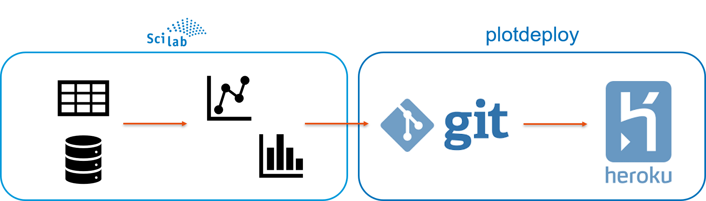
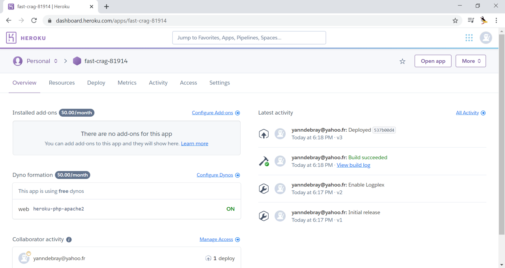
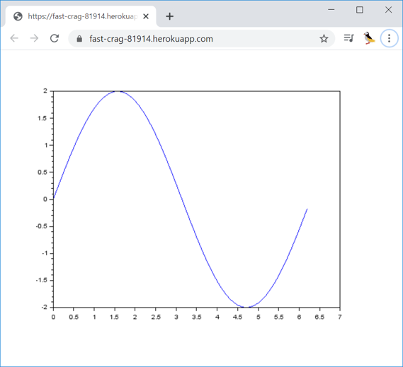

# plotdeploy

Deploy plot through a simple URL

## Prerequisites:

* [Git](https://git-scm.com/book/en/v2/Getting-Started-Installing-Git) installed on your PC
* [Heroku](https://signup.heroku.com/) account with [Heroku CLI](https://devcenter.heroku.com/articles/heroku-cli) installed on your PC
* Make sure you have both *heroku* and *git* accessible in your PATH

## Setup:

* Login to heroku

    $ heroku login

* Create an app

    $ heroku create

(keep the app name to deploy your plot)

You can alternatively create the app from the Heroku website:

## Demo

In this simple demonstration, we deploy a Scilab plot on a simple URL:

    x=[0:0.1:2*%pi];
    y=2*sin(x);
    plot(x,y)
    f=gcf();
    herokuapp=fast-crag-81914
    plotdeploy(f,herokuapp)

You simply need to replace the name of your heroku app to replicate it.

## Source:
[How to deploy a Simple Static HTML Website on Heroku](https://medium.com/@agavitalis/how-to-deploy-a-simple-static-html-website-on-heroku-492697238e48)
